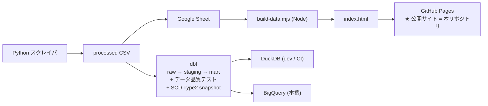

# 花火祭ナビ（hanabi-matsuri-navi）

日本全国の花火大会・祭りの開催情報を一つの画面で探せる、インタラクティブなダッシュボードです。分散している開催情報を収集・整理し、地図上で直感的に確認できる形にまとめました。

## デモ

**▶ [https://rimiru0303.github.io/hanabi-matsuri-navi/](https://rimiru0303.github.io/hanabi-matsuri-navi/)**

インストール不要、ブラウザでそのまま動作します（単一HTMLファイル構成）。

**▶ [分析レポート](https://rimiru0303.github.io/hanabi-matsuri-navi/report.html)**（開催傾向の統計ダッシュボード：月別・地域別分布、規模・費用構造など）

## 主な機能

- **地図ビジュアライゼーション**：都道府県境界・市区町村境界を表示し、地域ごとのイベント分布を可視化
- **イベント絞り込み**：都道府県などの条件でイベントを絞り込み表示
- **単一ファイル構成**：サーバー・データベース不要。HTMLファイル一つで完結するため、共有・閲覧が容易

## 技術スタック

| 領域 | 使用技術 |
| --- | --- |
| データ収集 | Python（Webスクレイピング） |
| データ処理 | Python（クレンジング・整形） |
| データ変換・検証 | dbt（raw→staging→mart／データ品質テスト）※非公開リポジトリ |
| データ基盤 | DuckDB（ローカル／CI）・BigQuery（本番）※非公開リポジトリ |
| ビルド | Node.js（データとUIを単一HTMLに統合） |
| フロントエンド | HTML / JavaScript（地図可視化） |

## データパイプライン

本リポジトリは **公開用の成果物（HTML ダッシュボード）のみ** を含みます。
データ収集から変換・品質検証までのパイプライン本体は、スクレイピング元・
認証情報・設定を含むため **別リポジトリで非公開管理** しています。
全体構成は下図のとおりで、詳細は面談時に画面共有でご説明します。

収集した開催情報を整形・統合し、地理データ（都道府県・市区町村境界）と
組み合わせてビルドすることで、外部依存のないポータブルなダッシュボードを
実現しています。開催情報は定期的に自動更新され、常に最新の状態を保っています。

### 非公開リポジトリに含まれる主な要素

- **dbt** による変換分層（raw → staging → mart）と、宣言的データ品質テスト
  （unique / not_null / accepted_values / relationships ＋ 自作 singular test 計約 34 件）
- **DuckDB（dev / CI）と BigQuery（本番）の 2 環境対応**
  （方言差を吸収する macro により同一 SQL を両環境で実行し、結果の一致を検証）
- 履歴管理の **SCD Type 2 スナップショット**、GitHub Actions による CI 自動テスト

## 開発について

開発では Claude Code を活用し、要件定義・データ設計・検証は自身で主導しました。
